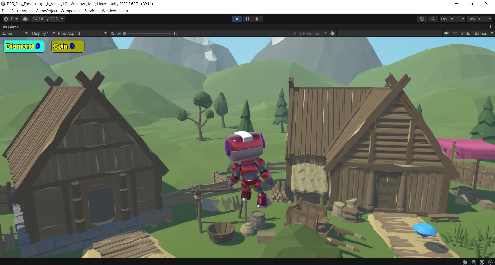
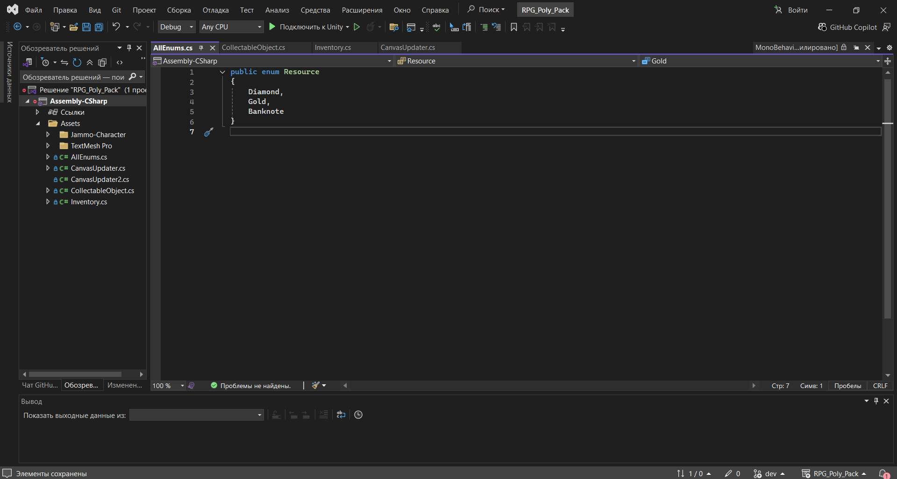

# The Diamond Collection game on an Unity Engine (3D RPG)

For details inform can you refer to base tutorials [#1](https://www.youtube.com/watch?v=K5FM6bz4qO4) and [#2](https://www.youtube.com/watch?v=veFxqpw8LKI),
also [HotKes](https://docs.unity3d.com/ru/2021.1/Manual/search-overview.html), [Engine lifecycle](https://docs.unity3d.com/ru/current/Manual/ExecutionOrder.html).

Explain lessons topics: Event, Enums, Coroutines, Singleton, Generic

+ Unity API:
  - [Audio](https://docs.unity3d.com/6000.3/Documentation/Manual/Audio.html)
  - [Managing scenes in Build Profiles](https://docs.unity3d.com/6000.3/Documentation/Manual/build-profiles.html)
  - [Managing scenes in Build Profiles](https://www.easyar.com/doc/ru/develop/unity/getting-started/quickstart.html)
  - [MonoBehaviour.Start()](https://docs.unity3d.com/6000.3/Documentation/ScriptReference/MonoBehaviour.Start.html)
  - [MonoBehaviour.Update()](https://docs.unity3d.com/6000.3/Documentation/ScriptReference/MonoBehaviour.Update.html)
  - [MonoBehaviour.OnDisable()](https://docs.unity3d.com/6000.3/Documentation/ScriptReference/MonoBehaviour.OnDisable.html)
  - [MonoBehaviour.Awake()](https://docs.unity3d.com/6000.3/Documentation/ScriptReference/MonoBehaviour.Awake.html)

+ Dev Environment:
  - **Unity Engine**: [6.3 (LTS)](https://docs.unity3d.com/6000.3/Documentation/Manual)
  - **Microsoft Visual Studio**: 2022 (_Community_)
  - **Game Assets**: [RPG Poly Pack](https://assetstore.unity.com/packages/3d/environments/landscapes/rpg-poly-pack-lite-148410?srsltid=AfmBOopyTWvyJbW2FR-QsMngGbpQUZwNhEXTJWuIjfRgfdgobDy4EBTA),
[Jammo Character](https://assetstore.unity.com/packages/3d/characters/jammo-character-mix-and-jam-158456?srsltid=AfmBOoqk_DhLTlslWLfZPgbMGYizJWE7Q7qxmtNsrSzryxVY0UAaVVsM),
[Coin Treasure Bundle](https://assetstore.unity.com/packages/3d/props/coin-treasure-bundle-with-animation-3d-250070?srsltid=AfmBOopmysnKe723e1sZXHBXWI6KgqJ4yItJOAX9NfgDMllOWX_Wu3dH)
  - **Sound Resources**: [Gaming victory](https://pixabay.com/sound-effects/search/victory),
[Game Over](https://pixabay.com/sound-effects/search/game-sad-music)

Blogs: [Создание игры на Unity с нуля](https://artean.ru/blog/igri/kak-sozdat-igru-na-unity-s-nulya-polnoe-rukovodstvo), [...](https://artean.ru/blog)

#### Game prcess:

#### Source code:

